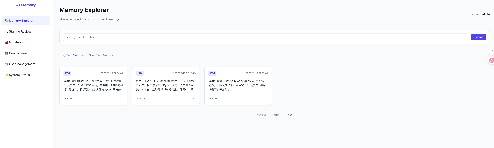
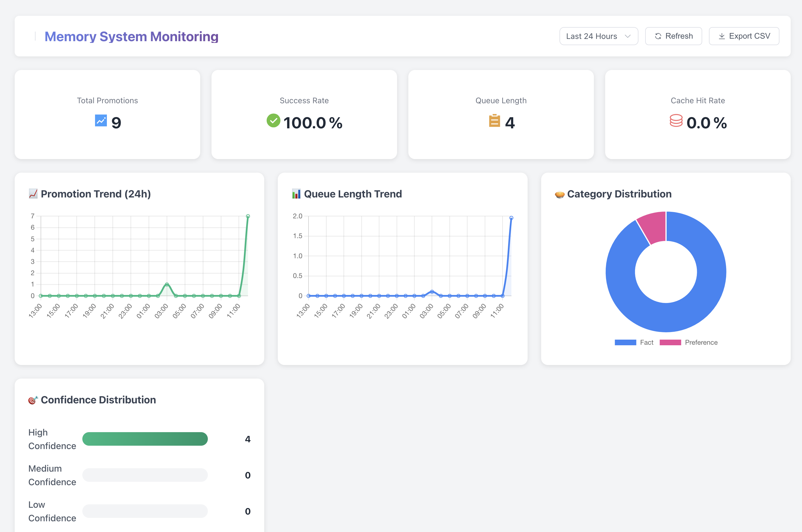
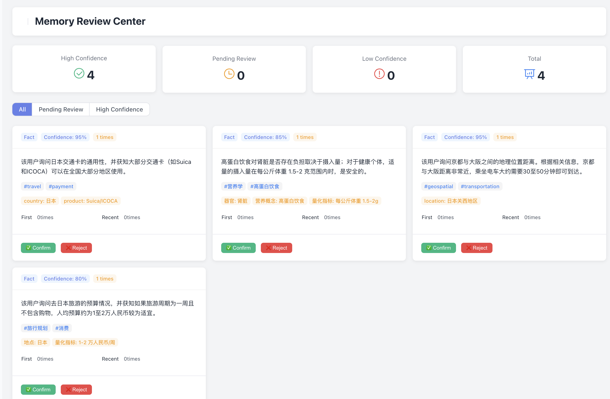
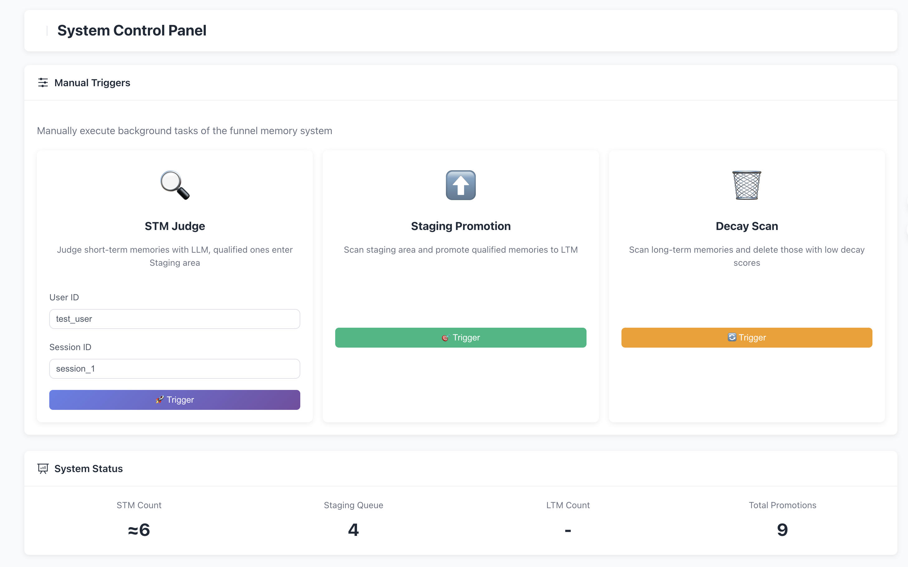
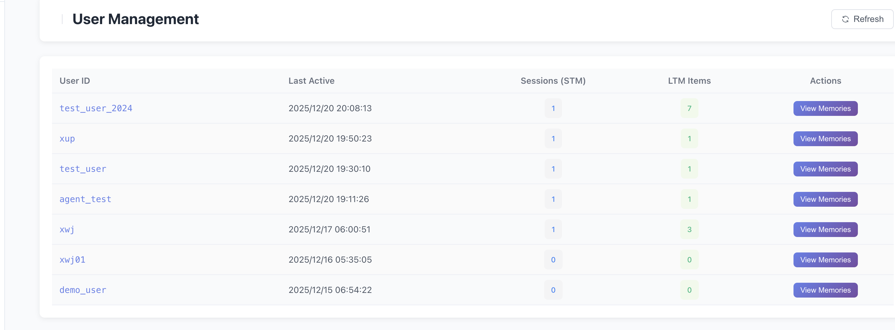
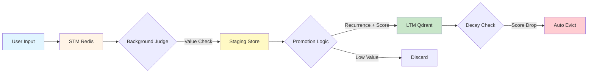

# 🧠 AI-Memory

[](https://opensource.org/licenses/MIT)
[](https://go.dev/)
[](https://redis.io/)
[](https://qdrant.tech/)

**[中文文档](./README_CN.md)** | English



> A biomimetic AI memory management framework that implements a human-like funnel memory system (STM → Staging → LTM), enabling AI agents to intelligently filter, retain, and recall valuable information.

---

## 🎯 Core Problem

Traditional AI conversation systems face critical memory challenges:

- **💸 Memory Dilemma**: Full retention is expensive; rapid forgetting breaks conversation continuity
- **🗑️ Information Noise**: Unable to distinguish valuable insights from trivial interactions
- **❄️ Cold Start**: Every conversation starts from zero, preventing long-term relationship building

**AI-Memory** solves these problems with a biologically-inspired architecture that automatically manages memory lifecycle—just like the human brain.

---

## ✨ Key Features

### 🧠 Biomimetic Funnel Architecture

Mimics human memory processes with three-tier filtering:

```
┌─────────────────────────────────────────────────────────┐
│  STM (Short-Term Memory)  │  Redis Sliding Window       │
│  ↓ Recent conversations   │  Configurable 7-day TTL     │
├─────────────────────────────────────────────────────────┤
│  Staging Area             │  Multi-Criteria Filtering   │
│  ↓ Value judgment         │  • Recurrence count         │
│                           │  • Time window verification │
│                           │  • LLM-based scoring        │
├─────────────────────────────────────────────────────────┤
│  LTM (Long-Term Memory)   │  Qdrant Vector Store        │
│  ✓ Core knowledge         │  Semantic search enabled    │
└─────────────────────────────────────────────────────────┘
```

### 🎯 Intelligent Value Judgment

- **Multi-Dimensional Scoring**: LLM evaluates memory importance, relevance, and uniqueness
- **Recurrence Validation**: Ideas repeated across sessions are more likely to be important
- **Time Window**: Prevents impulsive promotion, ensures stability
- **Confidence Grading**: Auto-promote high-confidence memories, auto-discard low-value noise

### ♻️ Semantic Deduplication

- **Staging Dedup**: Prevents duplicate memories from entering the funnel
- **LTM Pre-Promotion Check**: Ensures uniqueness before final storage
- **Hybrid Approach**: Vector similarity + LLM semantic comparison

### 📉 Automatic Decay & Forgetting

- **Ebbinghaus Curve**: Simulates natural memory decay over time
- **Configurable Half-Life**: Adjust decay rate based on use case
- **Auto-Cleanup**: Removes low-value memories below threshold score

### 📊 Monitoring & Dashboard

Real-time visibility into the memory system's health and performance:

- **Metric Tracking**: Promotion rates, queue lengths, cache hit rates
- **Visual Trends**: 24-hour trend lines for key activities
- **System Status**: Live component health checks (Redis, Qdrant)






### 🔧 Production-Ready Features

- **Multi-Store Coordination**: Redis (speed) + MySQL (structure) + Qdrant (semantics)
- **Fully Configurable**: All thresholds and timeouts via environment variables
- **Background Automation**: Scheduled tasks for staging promotion and decay cleanup
- **Admin Dashboard**: Vue.js frontend for memory management and monitoring

---

## 🚀 Quick Start

### Prerequisites

- **Go 1.25+**
- **Redis 7.0+**
- **MySQL 8.0+**
- **Qdrant 1.0+** (Vector database)
- **OpenAI API Key** (or compatible endpoint like SiliconFlow)

### Installation

```bash
# Clone the repository
git clone https://github.com/xwj-vic/AI-Memory.git
cd AI-Memory

# Copy and configure environment variables
cp .env.example .env
# Edit .env with your API keys and database credentials

# Run database schema
mysql -u root -p < schema.sql

# Install dependencies
go mod download

# Build the project
go build -o ai-memory

# Start the server
./ai-memory
```

The server will start on `http://localhost:8080`

**Default Admin Credentials**:
- Username: `admin`
- Password: `admin123`

---

## 📖 Architecture Overview

### Data Flow



### Storage Layers

| Layer | Storage | Purpose | TTL |
|-------|---------|---------|-----|
| **STM** | Redis | Recent conversation context | 7 days (configurable) |
| **Staging** | Redis Hash | Value judgment queue | Until promoted/discarded |
| **LTM** | Qdrant Vector DB | Long-term knowledge base | Decay-based (90-day half-life) |
| **Metadata** | MySQL | User profiles, system state | Permanent |

---

## 💡 Usage Example

### Adding Memory

```bash
curl -X POST http://localhost:8080/api/memory/add \
  -H "Content-Type: application/json" \
  -d '{
    "user_id": "user123",
    "session_id": "session456",
    "input": "I love hiking in the mountains",
    "output": "That sounds wonderful! What mountains do you usually visit?",
    "metadata": {"topic": "hobbies"}
  }'
```

### Retrieving Relevant Memories

```bash
curl -X GET "http://localhost:8080/api/memory/retrieve?user_id=user123&query=outdoor%20activities&limit=5"
```

### Response Format

```json
{
  "memories": [
    {
      "id": "uuid-xxxx",
      "content": "User enjoys hiking in mountainous regions",
      "type": "ltm",
      "metadata": {
        "ltm_metadata": {
          "importance": 0.85,
          "last_accessed": "2025-12-16T10:30:00Z",
          "access_count": 12
        }
      },
      "created_at": "2025-12-01T08:00:00Z"
    }
  ]
}
```

---

## ⚙️ Configuration

Key environment variables in `.env`:

### Memory Funnel Settings

```bash
# STM Configuration
STM_EXPIRATION_DAYS=7              # Auto-expire after N days
STM_WINDOW_SIZE=100               # Max recent messages
STM_BATCH_JUDGE_SIZE=10           # Batch processing size

# Staging Area
STAGING_MIN_OCCURRENCES=2         # Requires repetition
STAGING_MIN_WAIT_HOURS=48         # Cooling period
STAGING_VALUE_THRESHOLD=0.6       # Min score to promote
STAGING_CONFIDENCE_HIGH=0.8       # Auto-promote threshold
STAGING_CONFIDENCE_LOW=0.5        # Auto-discard threshold

# LTM Decay
LTM_DECAY_HALF_LIFE_DAYS=90       # Decay rate
LTM_DECAY_MIN_SCORE=0.3           # Eviction threshold
```

### LLM Provider

```bash
LLM_PROVIDER=openai
OPENAI_API_KEY=sk-your-key
OPENAI_BASE_URL=https://api.openai.com/v1
OPENAI_MODEL=gpt-4o-mini
OPENAI_EMBEDDING_MODEL=text-embedding-ada-002
```

> **💡 Tip**: For cost optimization, use `gpt-4o-mini` for judgment tasks and `gpt-4o` only for critical extraction tasks.

---

## 🎨 Admin Dashboard

Access the web UI at `http://localhost:8080` after starting the server.

**Features**:
- 📊 Memory statistics and trends
- 🔍 Search and filter memories by type/user
- ✏️ Edit or delete specific memories
- 👥 User management and session tracking

---

## 🏗️ Project Structure

```
ai-memory/
├── cmd/                    # CLI tools
├── pkg/
│   ├── api/               # REST API handlers
│   ├── auth/              # Authentication service
│   ├── config/            # Configuration loader
│   ├── llm/               # LLM client abstraction
│   ├── logger/            # Structured logging
│   ├── memory/            # Core memory logic
│   │   ├── manager.go     # Memory manager
│   │   ├── funnel.go      # Funnel system logic
│   │   ├── ltm_dedup.go   # LTM deduplication
│   │   └── interfaces.go  # Abstractions
│   ├── prompts/           # LLM prompt templates
│   ├── store/             # Storage implementations
│   │   ├── redis.go       # STM store
│   │   ├── qdrant.go      # Vector store
│   │   ├── mysql.go       # Metadata store
│   │   └── staging_store.go # Staging logic
│   └── types/             # Shared data models
├── frontend/              # Vue.js admin dashboard
├── schema.sql             # MySQL database schema
├── .env.example           # Configuration template
└── main.go                # Application entry point
```

---

## 🤝 Contributing

We welcome contributions! Please follow these steps:

1. Fork the repository
2. Create a feature branch (`git checkout -b feature/amazing-feature`)
3. Commit your changes (`git commit -m 'Add amazing feature'`)
4. Push to the branch (`git push origin feature/amazing-feature`)
5. Open a Pull Request

### Development Guidelines

- Follow Go best practices and idiomatic style
- Add tests for new features
- Update documentation for API changes
- Use meaningful commit messages

---

## 📄 License

This project is licensed under the MIT License - see the [LICENSE](LICENSE) file for details.

---

## 🙏 Acknowledgments

- **Qdrant** for the powerful vector search engine
- **OpenAI** for providing advanced LLM capabilities
- Inspired by research on human memory and cognitive psychology

---

## 📬 Contact

- **Author**: xwj-vic
- **GitHub**: [@xwj-vic](https://github.com/xwj-vic)
- **Issues**: [GitHub Issues](https://github.com/xwj-vic/AI-Memory/issues)

---

<p align="center">
  Made with ❤️ for the AI community
</p>
