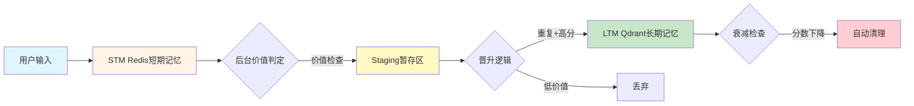

# 🧠 AI-Memory

[](https://opensource.org/licenses/MIT)
[](https://go.dev/)
[](https://redis.io/)
[](https://qdrant.tech/)

[English](./README.md) | **中文文档**


> 仿生AI记忆管理框架，实现人脑般的漏斗型记忆系统（STM → Staging → LTM），让AI智能体能够自动筛选、保留和回忆有价值的信息。

---

## 🎯 解决的核心问题

传统AI对话系统面临的记忆困境：

- **💸 记忆遗忘困境**：全量记忆成本高昂，快速遗忘导致对话割裂
- **🗑️ 信息噪音泛滥**：无法区分有价值信息和琐碎对话
- **❄️ 冷启动问题**：每次对话从零开始，无法建立长期关系

**AI-Memory** 通过仿生架构自动管理记忆生命周期——就像人脑一样。

---

## ✨ 核心特性

### 🧠 仿生漏斗架构

模拟人脑记忆过程，实现三级自动过滤：

```
┌─────────────────────────────────────────────────────────┐
│  STM 短期记忆             │  Redis 滑动窗口             │
│  ↓ 保留最近对话           │  可配置 7 天过期            │
├─────────────────────────────────────────────────────────┤
│  Staging 暂存区           │  多维度价值筛选             │
│  ↓ 价值判定               │  • 重复出现次数验证         │
│                           │  • 时间窗口冷却             │
│                           │  • LLM 智能评分             │
├─────────────────────────────────────────────────────────┤
│  LTM 长期记忆             │  Qdrant 向量数据库          │
│  ✓ 核心知识永久保存       │  支持语义检索               │
└─────────────────────────────────────────────────────────┘
```

### 🎯 智能价值判定

- **多维度评分**：LLM 评估记忆的重要性、相关性和独特性
- **重复验证**：跨会话重复出现的想法更可能重要
- **时间窗口**：防止冲动晋升，确保记忆稳定性
- **置信度分级**：高置信度自动晋升，低价值噪音自动丢弃

### ♻️ 语义去重机制

- **暂存区去重**：防止重复记忆进入漏斗
- **LTM 晋升前检查**：最终存储前确保唯一性
- **混合方案**：向量相似度 + LLM 语义对比双重验证

### 📉 自动衰减遗忘

- **艾宾浩斯曲线**：模拟自然记忆衰减过程
- **可配置半衰期**：根据使用场景调整衰减速率
- **自动清理**：删除低于阈值分数的低价值记忆

### 🔧 生产级特性

- **多存储协同**：Redis（快速） + MySQL（结构化） + Qdrant（语义化）
- **完全可配置**：所有阈值和超时参数均可通过环境变量调整
- **后台自动化**：定时任务处理暂存晋升和衰减清理
- **管理后台**：Vue.js 前端实现记忆管理和监控

---

## 🚀 快速开始

### 环境要求

- **Go 1.25+**
- **Redis 7.0+**
- **MySQL 8.0+**
- **Qdrant 1.0+**（向量数据库）
- **OpenAI API Key**（或兼容端点如 SiliconFlow）

### 安装步骤

```bash
# 克隆仓库
git clone https://github.com/xwj-vic/AI-Memory.git
cd AI-Memory

# 复制并配置环境变量
cp .env.example .env
# 编辑 .env 填入你的 API 密钥和数据库凭证

# 导入数据库表结构
mysql -u root -p < schema.sql

# 安装依赖
go mod download

# 构建项目
go build -o ai-memory

# 启动服务
./ai-memory
```

服务将在 `http://localhost:8080` 启动

**默认管理员账号**：
- 用户名：`admin`
- 密码：`admin123`

---

## 📖 架构概览

### 数据流程图



### 存储分层

| 层级 | 存储引擎 | 用途 | 过期策略 |
|------|----------|------|----------|
| **STM** | Redis | 最近对话上下文 | 7天（可配置） |
| **Staging** | Redis Hash | 价值判定队列 | 晋升或丢弃前保留 |
| **LTM** | Qdrant 向量库 | 长期知识库 | 基于衰减（90天半衰期） |
| **元数据** | MySQL | 用户档案、系统状态 | 永久保存 |

---

## 💡 使用示例

### 添加记忆

```bash
curl -X POST http://localhost:8080/api/memory/add \
  -H "Content-Type: application/json" \
  -d '{
    "user_id": "user123",
    "session_id": "session456",
    "input": "我喜欢在山里徒步旅行",
    "output": "听起来很棒！你通常去哪些山区？",
    "metadata": {"topic": "兴趣爱好"}
  }'
```

### 检索相关记忆

```bash
curl -X GET "http://localhost:8080/api/memory/retrieve?user_id=user123&query=户外活动&limit=5"
```

### 响应格式

```json
{
  "memories": [
    {
      "id": "uuid-xxxx",
      "content": "用户喜欢在山区徒步旅行",
      "type": "ltm",
      "metadata": {
        "ltm_metadata": {
          "importance": 0.85,
          "last_accessed": "2025-12-16T10:30:00Z",
          "access_count": 12
        }
      },
      "created_at": "2025-12-01T08:00:00Z"
    }
  ]
}
```

---

## ⚙️ 配置说明

`.env` 文件中的关键环境变量：

### 记忆漏斗设置

```bash
# STM 短期记忆配置
STM_EXPIRATION_DAYS=7              # N天后自动过期
STM_WINDOW_SIZE=100                # 最大保留消息数
STM_BATCH_JUDGE_SIZE=10            # 批量处理大小

# Staging 暂存区配置
STAGING_MIN_OCCURRENCES=2          # 需要重复出现次数
STAGING_MIN_WAIT_HOURS=48          # 冷却期（小时）
STAGING_VALUE_THRESHOLD=0.6        # 晋升最低分数
STAGING_CONFIDENCE_HIGH=0.8        # 自动晋升阈值
STAGING_CONFIDENCE_LOW=0.5         # 自动丢弃阈值

# LTM 长期记忆衰减配置
LTM_DECAY_HALF_LIFE_DAYS=90        # 衰减半衰期
LTM_DECAY_MIN_SCORE=0.3            # 清理阈值
```

### LLM 提供商配置

```bash
LLM_PROVIDER=openai
OPENAI_API_KEY=sk-your-key
OPENAI_BASE_URL=https://api.openai.com/v1
OPENAI_MODEL=gpt-4o-mini
OPENAI_EMBEDDING_MODEL=text-embedding-ada-002
```

> **💡 提示**：为节省成本，判定任务使用 `gpt-4o-mini`，仅在关键提取任务使用 `gpt-4o`。

---

## 🎨 管理后台

启动服务后访问 `http://localhost:8080` 即可使用 Web 管理界面。

**功能特性**：
- 📊 记忆统计和趋势分析
- 🔍 按类型/用户搜索和筛选记忆
- ✏️ 编辑或删除特定记忆
- 👥 用户管理和会话追踪

---

## 🏗️ 项目结构

```
ai-memory/
├── cmd/                    # 命令行工具
├── pkg/
│   ├── api/               # REST API 处理器
│   ├── auth/              # 认证服务
│   ├── config/            # 配置加载器
│   ├── llm/               # LLM 客户端抽象
│   ├── logger/            # 结构化日志
│   ├── memory/            # 核心记忆逻辑
│   │   ├── manager.go     # 记忆管理器
│   │   ├── funnel.go      # 漏斗系统逻辑
│   │   ├── ltm_dedup.go   # LTM 去重
│   │   └── interfaces.go  # 接口抽象
│   ├── prompts/           # LLM 提示词模板
│   ├── store/             # 存储实现
│   │   ├── redis.go       # STM 存储
│   │   ├── qdrant.go      # 向量存储
│   │   ├── mysql.go       # 元数据存储
│   │   └── staging_store.go # 暂存逻辑
│   └── types/             # 共享数据模型
├── frontend/              # Vue.js 管理后台
├── schema.sql             # MySQL 数据库表结构
├── .env.example           # 配置模板
└── main.go                # 应用程序入口
```

---

## 🤝 参与贡献

我们欢迎贡献！请遵循以下步骤：

1. Fork 本仓库
2. 创建特性分支 (`git checkout -b feature/amazing-feature`)
3. 提交你的更改 (`git commit -m '添加某个很棒的特性'`)
4. 推送到分支 (`git push origin feature/amazing-feature`)
5. 提交 Pull Request

### 开发指南

- 遵循 Go 最佳实践和惯用风格
- 为新特性添加测试
- 更新 API 变更的文档
- 使用有意义的提交信息

---

## 📄 开源协议

本项目基于 MIT 协议开源 - 详见 [LICENSE](LICENSE) 文件

---

## 🙏 致谢

- **Qdrant** 提供强大的向量搜索引擎
- **OpenAI** 提供先进的 LLM 能力
- 受人类记忆和认知心理学研究启发

---

## 📬 联系方式

- **作者**：xwj-vic
- **GitHub**：[@xwj-vic](https://github.com/xwj-vic)
- **问题反馈**：[GitHub Issues](https://github.com/xwj-vic/AI-Memory/issues)

---

<p align="center">
  用 ❤️ 为 AI 社区打造
</p>
